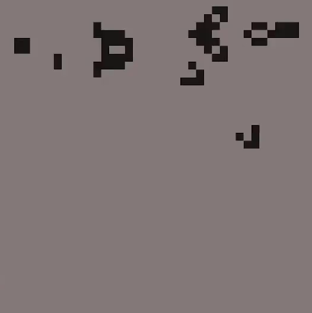

#### Pygame graphics
##### by hippyclipper

[Noise Flow Field](./src/noiseFlowField.py)

https://user-images.githubusercontent.com/79437955/185469159-f192c48b-8b33-4c2f-ba2d-e0c7202636b8.mp4

[Ray Cast](./src/rayCast.py)

https://user-images.githubusercontent.com/79437955/185470499-71b7e6ff-578e-4ecb-9602-bb8a37bc1565.mp4

[Gravity](./src/gravity.py)

[Game of Life](./src/gameOfLife.py)

[Circles](./src/cirlces.py)

[Fireworks](./src/fireworks.py)

[Star Field](./src/starfield.py)

